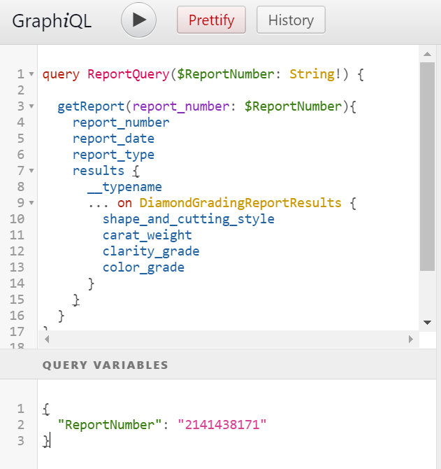

# GIA Report Results API Documentation
{:.no_toc}

The GIA Report Results API enables applications to integrate with GIA's database in order to verify grading information and retrieve assets associated with a report. 

This guide provides the background and details for integrators to evaluate our APIs, and to get started writing code against live endpoints in our sandbox or production environments.

## Contents 
{:.no_toc}

* TOC
{:toc}

## Concepts

While the API's premise is simple: submit a report number and obtain the report's results, there are details to be aware of. Be sure to read this document carefully.

#### GraphQL

The GIA Report Results API is built using [GraphQL](https://graphql.org/). GraphQL is a query language supported by all major programming languages. The benefit of GraphQL is that you can request only the data you need, and that data is returned in a single response.

This means you must specify the data you want in the form of a query passed to the API.

The good news is that most tools provide documentation navigators to help you explore the API. To learn more, try our [Quickstart Guide](/report-results/quickstart).

#### Report Results

The GIA Report Results API returns results for nearly all of GIA's reports and services through a single endpoint called `getReport`.

A call to `getReport` returns a `GradingReport` with fields common to all reports. These include report number, report date, and report type.

However, different report types naturally have different fields in their results. For example, a diamond report has different results than a sapphire report. 

To handle this, the `results` field contains a [union type](https://graphql.org/learn/schema/#union-types) called `ReportResults` that will return one of the following concrete types: 

* `DiamondGradingReportResults` for grading services on natural diamonds, such as Diamond Dossier, Diamond Grading, and Colored Diamond Grading reports.
* `PearlIdentReportResults` for Pearl Identification and Pearl Identification and Classification reports.
* `LabGrownDiamondGradingReportResults` for Lab-Grown (formerly Synthetic) diamond reports.
* `IdentificationReportResults` for reports on colored stones such as sapphire, ruby, tourmaline, and others.
* `MeleeServiceResults` for results on the Melee Analysis service.
* `NarrativeReportResults` for results that do not fit in the other formats.

Since the results field may be populated by any of these concrete types, you must use a [conditional fragment](https://graphql.org/learn/queries/#inline-fragments) (such as `... on DiamondGradingReportResults`) to return any fields at all.

__Pro Tip__: Use the [__typename](https://graphql.org/learn/queries/#meta-fields) meta field to determine how to handle the data on your client.

```
{
  getReport(report_number: "2141438171") {
    report_date
    report_number
    report_type
    results {
      ... on DiamondGradingReportResults {
        __typename
        shape_and_cutting_style
        carat_weight
        color_grade
        clarity_grade
      }
    }
  }
}
```

returns

```
{
  "data": {
    "getReport": {
      "report_date": "September 01, 2019",
      "report_number": "2141438171",
      "report_type": "Diamond Dossier",
      "results": {
        "__typename": "DiamondGradingReportResults",
        "shape_and_cutting_style": "Emerald Cut",
        "carat_weight": "0.51 carat",
        "color_grade": "E",
        "clarity_grade": "VS2"
      }
    }
  }
}
```

#### Data Types

Most results fields are [String](https://graphql.org/learn/schema/#scalar-types) types to accomodate the text as it appears on a grading report. For example, `Internally Flawless` clarity grades will be spelled out rather than abbreviated `IF`.

In most cases, the abbreviated versions are also available. These [Enums](https://graphql.org/learn/schema/#enumeration-types) are validated to be one of the allowed values. Look for fields that end with `_code`. Examples are `report_type_code`, `clarity_grade_code`, and `color_grade_code`.

Fields that are concatenated in the results are also available as individual fields. For example, measurements are stated as "minimum diameter - maximum diameter x depth" for round diamonds and "length x width x depth" for fancy shapes. The individual fields are expressed in the `RoundMeasurements` and `FancyMeasurements` types.

#### Asset Links

Links to assets are contained in the `links` field. The availability of assets is dependent on the type of report you are querying. If an asset is not available the field will return `null`.

Assets available are:

* __PDF Facsimile__ A PDF representation of the grading report. Available for most, but not all, report types.
* __Proportions Diagram__ The diagram representing the proportions of the diamond. Available on diamond reports such as the Diamond Dossier and Diamond Grading Report.
* __Plotting Diagram__  The diagram representing clarity characteristics. Available for full grading reports such as the Diamond Grading Report.
* __Image__ Any photograph of the image that is printed on the report. Available for most colored stones and pearl reports and some colored diamond reports.
* __Rough Image and Video__ Image and video taken during rough analysis. Available for the Diamond Origin and Colored Diamond Origin Reports.
* __Polished Image and Video__ Image and video taken after diamond is matched to the rough and issued an origin report. Available for the Diamond Origin and Colored Diamond Origin reports.

The links returned by the GIA Report Results API are active for 60 minutes from the API call. If you attempt to access the asset after this period, you will receive an error response.

#### Checking for Stale Reports

Since GIA Grading Reports can be updated after issuance, it is necessary to periodically review the status of any reports that are cached in your systems.

Passing a report number and date to `isReportUpdated` in order to determine whether or not a report has been updated. If the response is `false`, there is no need for you to query `GetReport` for updated data.

Calling `isReportUpdated` does not incur a lookup.

```graphql
{
  isReportUpdated(report_number: "6203489265", report_date: "2020-01-01") {
    report_updated
  }
}
```

returns

```json
{
  "data": {
    "isReportUpdated": {
      "report_updated": false,
    }
  }
}
```

## Connecting to the API

### Crafting Your Request

To query the GIA Report Results API, you must construct the request body, convert it to JSON, and send it to the endpoint as a POST request with the proper headers. 

Follow these steps to construct an API request.

##### Step 1: Craft a valid query using a GraphQL-aware tool.

Use a tool such as GraphiQL, Insomnia, or Altair to construct, test, and validate your query prior to writing code. Instructions for GraphiQL are in the [Quickstart Guide](/report-results/quickstart).

We'll use this example query throughout this section.



```
query ReportQuery($ReportNumber: String!) {
    getReport(report_number: $ReportNumber){
        report_number
        report_date
        report_type
        results {
            __typename
            ... on DiamondGradingReportResults {
                shape_and_cutting_style
                carat_weight
                clarity_grade
                color_grade
            }
        }
        quota {
            remaining
        }
    }
}
```

Note the use of the `ReportNumber` query variable.
```
{
  "ReportNumber": "2141438171"
}
```

Be sure this query successfully returns results before proceeding to the next steps.

##### Step 2: Construct a GraphQL request body using your languages idioms

The body you send to the API must conform to [GraphQL standards](https://graphql.org/learn/serving-over-http/#post-request). 

The best practice is to construct this structure using the features of your language prior to converting to JSON. The details will vary by language, but the process will be similar.

The API expects this structure:
```
{
  "query": "YOUR_QUERY_GOES_HERE", 
  "variables": { 
    "YOUR_VARIABLE_NAME_GOES_HERE": "YOUR_VARIABLE_VALUE_GOES_HERE" 
  } 
}
```

You know the elements (query, variable name, and value) from Step 1. In our example, the query is displayed above, the variable name is `ReportNumber` and the value is `"2141438171"`.

One way to construct the request body is to use Dictionary elements:

1. Create a dictionary object called `query_variables` of type (`String`, `String`).
2. Insert an element into `query_variables` with `ReportNumber` as the index and  `"2141438171"` as the value.
3. Create a second dictionary object called `body` of type (`String`, `Object`)
4. Insert an element into `body` with `query` as the index and the query you drafted in Step 1 as the value.
5. Insert a second element into `body` with `variables` as the index and `query_variables` as the value

```
// Example in C#

var query = @"
query ReportQuery($ReportNumber: String!) {
    getReport(report_number: $ReportNumber){
        report_number
        report_date
        report_type
        results {
            __typename
            ... on DiamondGradingReportResults {
                shape_and_cutting_style
                carat_weight
                clarity_grade
                color_grade
            }
        }
        quota {
            remaining
        }
    }
}
";

// Set the report number to lookup
var reportNumber = "2141438171";

// Construct the request body to be POSTed to the graphql server
var query_variables = new Dictionary<string, string>
{
    { "ReportNumber", reportNumber}
};
var body = new Dictionary<string, object>
{
    { "query", query },
    { "variables", query_variables }
};

```

##### Step 3: Convert the request body object to JSON

Your programming language will have a module for serializing objects to JSON. 

```
// Example in C#: 

string json = JsonSerializer.Serialize(body);
```

> __Tip__: Avoid hand-coding your JSON body. Use the tools your language provides.

##### Step 4: Construct the HTTP request

Constructing an HTTP request will vary depending on your programming language. However, the steps are the similar: instantiate a HTTP client and set the required headers.

On your request, you must set two HTTP headers:

* __Authorization__: Set this to the API Key you received at signup
* __Content-Type__: Set this to `application/json`

> __Do not embed API keys directly in code__: API keys that are embedded in code can be accidentally exposed to the public, for example, if you forget to remove the keys from code that you share. Instead of embedding your API keys in your applications, store them in environment variables or in files outside of your application's source tree.

```
// Example in C# 

var client = new WebClient()

// key contains the API key
client.Headers.Add(HttpRequestHeader.Authorization, key);
client.Headers.Add(HttpRequestHeader.ContentType, "application/json");

```

> __Tip__: You do not need a specialized GraphQL client to query the API. You can use the HTTP client provided by your programming language.

##### Step 5: POST the HTTP request

You are now ready to send the request to the API.

* HTTP method must be POST
* The address is the URL given when you signed up for the API
* The body is the JSON you serialized in Step 3

```
// Example in C#

// Send the payload as a JSON to the endpoint
var response = client.UploadString(url, json);
```

### Parsing the Response

#### Overview

The GIA Report Results API returns responses in [JSON](https://www.json.org/). The shape of the JSON response will align with the GraphQL query you submitted to the server. You will use the tools provided by your programming language to parse the JSON response.

#### Checking for Errors

Error checking the GraphQL response requires attention at several points. Follow this guidance to ensure that you detect and respond to error conditions.

1. Ensure you received a successful HTTP request. If you receive an error such as `Unknown Host` or `Request Timed Out` then your request did not properly reach the server. If you receive a response other than `HTTP 200 OK` you have encounted an error and your response will not contain the report results you requested.
2. Check the GraphQL [errors](https://graphql.org/learn/serving-over-http/#response) field in the response. If the server encountered errors during processing, the `errors` field will be populated with a list of errors encountered. You must check this errors object to determine the cause of the error.

For more information, see [Error Conditions](#error-conditions).

#### Working with the Response

The tools you use depend on the language you are using. With statically-typed languages such as C# and Java, you will need to either (a) deserialize the JSON object into a native class or (b) use a library which allows you to natively work with the JSON document.

Option (a) can be tricky given the polymorphic nature of the `ReportResults` object. This approach is not discussed further in this document.

The C# and Java examples provided by GIA demonstrate one method of deconstructing the JSON document into its various fields. Also recognize that other libraries provide similar functionality and may ease development.

## Platform Overview

GIA has invested heavily in engineering this system for the highest possible performance, security, and availability. This section contains details you need to know in order to reliably and securely connect to the API.

### API Plans and Quota Monitoring

Usage of the GIA Report Results API is enabled by a plan. Each plan has a number of report requests associated with it. When this quota is depleted, you will no longer be able to retrieve report results. It is important that you track your quota and take action when necessary.

There are multiple ways to retrieve your quota:

1. Call `getQuota` to retrieve your remaining quota. Calling getQuota does not affect your remaining quota.
2. Call `getReport` and request the `quota { remaining }` field as part of the response. 
3. View your quota by signing in to your GIA Report Results API dashboard.

> __Note:__ If you request your quota as part of multiple reports in a single request, the system will calculate your remaining quota within each individual report lookup. In that case, your correct remaining quota will be the minimum of all `remaining` values in the response.
>
> Calling `getQuota` alone (that is, as a request separate from any calls to `getReport` will always return the exact number of report lookups remaining.)

### API Keys

API keys are used to authenticate and authorize requests to the API. A plan may have multiple keys and you may revoke any key without affecting other keys on the plan.

> __Important:__ For your protection, you must securely store these keys and they must not be shared! You are responsible for taking all precautions to safeguard access to the keys.

### Sandbox Environment

Once you apply for API access, you will be issued a sandbox plan and an associated key. This key can be used to access a limited set of reports that represent the variety of results you can expect from the API. 

The sandbox plan will be initially loaded with a number of report lookups. This will allow you to view your quota usage as you develop your application. If you require additional quota on your sandbox plan, we will be happy to assist. There is no charge to add quota to your sandbox API plan.

### Moving to Production

Once your API application is approved by GIA, you will be able to add a production API plan. API keys associated with this plan may access the full set of reports available in GIA's database.

### Quota Monitoring

You may check your remaining quota at any time by using `getQuota`. Checking your quota does not affect your remaining quota.

```
{
  getQuota{
    remaining
  }
}
```

You can also get your remaining quota with each query to `getReport`.

```
{
  getReport(report_number: "2141438171") {
    report_date
    report_number
    report_type
    quota{
      remaining
    }
  }
}
```

returns

```
{
  "data": {
    "getReport": {
      "report_date": "September 01, 2019",
      "report_number": "2141438171",
      "report_type": "Diamond Dossier",
      "quota": {
        "remaining": 967
      }
    }
  }
}
```

#### Quota Buckets

Each purchase of lookups added to your API plan will create a new "quota bucket". You may now query all quota buckets for the initial amount of lookups, the number remaining, and the expiration date of the bucket.

```graphql
{
  getQuota {
    remaining
    buckets {
      id
      initial
      remaining
      expiration_date
      status
    }
  }
}
```

returns

```json
{
  "data": {
    "getQuota": {
      "remaining": 1284,
      "buckets": [
        {
          "id": "2e35ceaf-7957-4b7b-94b8-8253df37d08e",
          "initial": 5000,
          "remaining": 1284,
          "expiration_date": "2021-02-04T15:19:00Z",
          "status": "ACTIVE"
        }
      ]
    }
  }
}
```

### Rate Limits

Rate limiting is applied based on the authorization key. If the API returns status code `429`, it means that you have sent too many requests. When this happens, check the `Retry-After` header, where you will see a number displayed. This is the number of seconds that you need to wait before you try your request again.

### System Status

The GIA Report Results API is engineered for high availability. You may view our current system status and historical uptime at [status.gia.edu](https://status.gia.edu).

__Important:__ You must subscribe to notifications at [status.gia.edu](https://status.gia.edu). This is the sole method we will use to update you on planned maintenance or unplanned incidents.

### Migrating from the Legacy Report Check API

GIA has made some minor changes to the way fields are coded in the new API.  In most cases, we have provided both the old and new fields. However, we have not yet made culet and girdle short codes available via the API.

Example:

| Field | Legacy Report Check API | Report Results API |
|-------|-------------------------|--------------------|
| Culet | VSM | Very Small |
| Girdle | STK to THK, F | Slightly Thick to Thick, Faceted |

We plan to enhance the API with the short codes `culet_size`, `girdle_min`, `girdle_max`, and `girdle_condition` at a later date. In the meantime, please use these lookup tables to map the necessary short codes.

#### Culet Size 

|     Meaning            |     Code    |
|------------------------|-------------|
|     None               |     NON     |
|     Very Small         |     VSM     |
|     Small              |     SML     |
|     Medium             |     MED     |
|     Slightly Large     |     SLG     |
|     Large              |     LGE     |
|     Very Large         |     VLG     |
|     Extremely Large    |     ELG     |
|     Not Applicable     |     N/A     |

#### Girdle Thickness

|     Meaning            |     Code    |
|------------------------|-------------|
|     Extremely Thin     |     ETN     |
|     Very Thin          |     VTN     |
|     Thin               |     THN     |
|     Medium             |     MED     |
|     Slightly Thick     |     STK     |
|     Thick              |     THK     |
|     Very Thick         |     VTK     |
|     Extremely Thick    |     ETK     |
|     Not Applicable     |     N/A     |

#### Girdle Condition

|     Meaning            |     Code    |
|------------------------|-------------|
|     Faceted            |     F       |
|     Polished           |     P       |
|     Bruted             |     B       |
|     Lasered            |     L       |
|     Not Applicable     |     N/A     |

### Error Conditions

#### Report not found

The API will return `HTTP 200 OK` call if the requested report is unavailable. The errors object will include a message that the item is unavailable and an error code.

```
{
  "data": {
    "getReport": null
  },
  "errors": [
    {
      "path": [
        "getReport"
      ],
      "data": null,
      "errorType": "REPORT UNAVAILABLE",
      "errorInfo": "REPORT NOT FOUND",
      "locations": [
        {
          "line": 2,
          "column": 3,
          "sourceName": null
        }
      ],
      "message": "This report does not exist or is not available through Report Check. For further information, please contact us. Code: c7b893ee-63ba-4e03-be84-83ef13da222f"
    }
  ]
}
```

| Possible Cause | Solution |
| --- | ----------- |
| You are using a sandbox key to access a non-sandbox report number. | Obtain a production key. |
| The requested report number does not exist. | Check your entries and try again. |
| The report exists, but has not been returned to the client and is not yet available. | Retry your query after item has been returned to the client. |
| The report exists, but is unavailable for other reasons. | Contact GIA for further information. |

#### Item is Undergoing Service

Items that are currently being serviced by GIA are unavailable through this API. 

```
{
  "data": {
    "report1": null,
  },
  "errors": [
    {
      "path": [
        "report1"
      ],
      "data": null,
      "errorInfo": REPORT IN HOUSE
      "errorType":  REPORT UNAVAILABLE
      "locations": [
        {
          "line": 3,
          "column": 3,
          "sourceName": null
        }
      ],
      "message": "The item with this report number is undergoing service by GIA. Once service is completed and the item is returned, report results will be displayed. Please try your search later."
    }
  ]
}
```

#### Invalid key

An invalid key will return a `HTTP 403 Forbidden` and this body content:

```
{
  "message": "Authorization denied."
}
```

| Possible Cause | Solution |
| --- | ----------- |
| Your key is inactive. | Log in to the developer portal and confirm your key. |

#### Quota limit exceeded

Submitting a query that exceeds your quota will return `HTTP 200 OK` and an error response in the body of the message.

```
{
  "data": {
    "getReport": null
  },
  "errors": [
    {
      "path": [
        "getReport"
      ],
      "data": null,
      "errorInfo": PLAN QUOTA MET
      "errorType":  QUOTA REACHED
      "locations": [
        {
          "line": 2,
          "column": 3,
          "sourceName": null
        }
      ],
      "message": "QuotaUsageLimit"
    }
  ]
}
```

| Possible Cause | Solution |
| --- | ----------- |
| Your quota limit has been consumed or has expired. | Add additional lookups through the developer portal. |

#### Newer report issued

From time to time, GIA re-examines items and issues new reports on those items. In those cases a query to the original report will be redirected to the newer report. Details will be returned in the `info_message` field.

#### Asset Link Expired

Asset links expire 60 minutes from the time you query the API. Requesting an asset using an expired URL returns `HTTP 403 Forbiddden` and a "Request has Expired" message.

```
<Error>
  <Code>AccessDenied</Code>
  <Message>Request has expired</Message>
  <Expires>2019-09-28T15:47:27Z</Expires>
  <ServerTime>2019-09-28T16:10:51Z</ServerTime>
  <RequestId>F73DF5DE0563DEE8</RequestId>
  <HostId>
    ADy4EQkt1sui/87CpxtQe5CMmBq8fejXckZiaB5Ui4bjfA21ky7Lp4wGBlw47A87haeruBbu90o=
  </HostId>
</Error>
```

| Possible Cause | Solution |
| --- | ----------- |
| The asset link has expired. | Query `getReport` to obtain a new asset link. |

#### MalformedHttpRequestException

```
{
  "errors" : [ {
    "message" : "Invalid JSON payload in POST request.",
    "errorType" : "MalformedHttpRequestException"
  } ]
}
```

| Possible Cause | Solution |
| --- | ----------- |
| JSON is invalid. | Ensure the JSON you submit is well-formed. |
| Improper nesting of escape characters. | Avoid using string concatenation and check that you are escaping properly for your language. |

## Providing Feedback

Your feedback will be extremely helpful for future improvements to the GIA Report Results API. Please let us know of any suggestions, ideas, or bugs that you encounter. You can find us at [GIA.edu/contactus](https://www.gia.edu/contactus).

If you encounter an unexpected error condition in the GIA Report Results API, please include the error code returned in the response.
