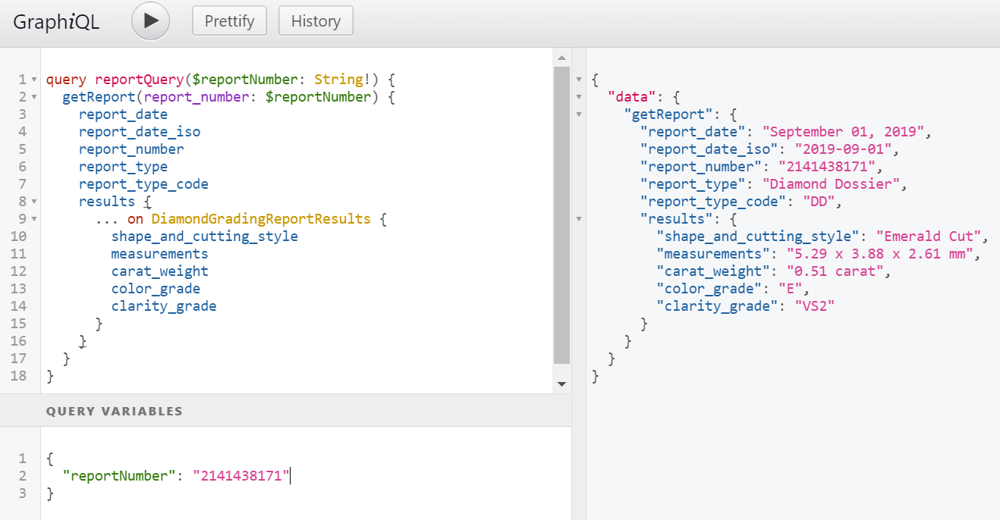

# GIA Report Results API Example Queries
{:.no_toc}

## Contents 
{:.no_toc}

* TOC
{:toc}

## Diamond Results

This query returns grading results for diamond reports such as Diamond Dossier, Diamond Grading, Colored Diamond Grading, and Diamond Origin reports.


```
{
  getReport(report_number:"2141438171") {
    report_date
    report_date_iso
    report_number
    report_type
    report_type_code
    industry_disclosures {
				disclosed_source{
						name
						code
				}
		}
    results {
      ... on DiamondGradingReportResults {
        shape_and_cutting_style
        measurements
        carat_weight
        color_grade
        color_origin
        color_distribution
        clarity_grade
        cut_grade
        polish
        symmetry
        fluorescence
        clarity_characteristics
        inscriptions
        report_comments
        proportions {
          depth_pct
          table_pct
          crown_angle
          crown_height
          pavilion_angle
          pavilion_depth
          star_length
          lower_half
          girdle
          culet
        }
      }
    }
  }
}
```

result

```
{
  "data": {
    "getReport": {
      "report_date": "September 01, 2019",
      "report_date_iso": "2019-09-01",
      "report_number": "2141438171",
      "report_type": "Diamond Dossier",
      "report_type_code": "DD",
      "industry_disclosures": {
				"disclosed_source": {
					"name": "South Africa",
					"code": "COO0001"
				}
			},
      "results": {
        "shape_and_cutting_style": "Emerald Cut",
        "measurements": "5.29 x 3.88 x 2.61 mm",
        "carat_weight": "0.51 carat",
        "color_grade": "E",
        "color_origin": null,
        "color_distribution": null,
        "clarity_grade": "VS2",
        "cut_grade": null,
        "polish": "Very Good",
        "symmetry": "Good",
        "fluorescence": "None",
        "clarity_characteristics": "Cloud, Needle",
        "inscriptions": "GIA 2141438171, YOUR LOGO OR PERSONAL MESSAGE HERE",
        "report_comments": "SAMPLESAMPLESAMPLESAMPLE",
        "proportions": {
          "depth_pct": "67.2",
          "table_pct": "63",
          "crown_angle": null,
          "crown_height": null,
          "pavilion_angle": null,
          "pavilion_depth": null,
          "star_length": null,
          "lower_half": null,
          "girdle": "Slightly Thick to Thick",
          "culet": "Very Small"
        }
      }
    }
  }
}
```

Note that fields that do not apply to the requested report return `null`. In this example, `cut_grade`, `color_origin`, `color_distribution`, and several proportions fields are not populated.

## Using Query Variables

It is not desirable to hard-code arguments into a query string. Your application should make use of [query variables](https://graphql.org/learn/queries/#variables) to safely pass user-supplied values to the query.

```
query reportQuery($reportNumber: String!) {
  getReport(report_number: $reportNumber) {
    report_date
    report_date_iso
    report_number
    report_type
    report_type_code
    results {
      ... on DiamondGradingReportResults {
        shape_and_cutting_style
        measurements
        carat_weight
        color_grade
        clarity_grade
      }
    }
  }
}
```

The dynamic data (that is, report_number) is passed in JSON.

```
{
  "reportNumber": "2141438171"
}
```

response

```
{
  "data": {
    "getReport": {
      "report_date": "September 01, 2019",
      "report_date_iso": "2019-09-01",
      "report_number": "2141438171",
      "report_type": "Diamond Dossier",
      "report_type_code": "DD",
      "results": {
        "shape_and_cutting_style": "Emerald Cut",
        "measurements": "5.29 x 3.88 x 2.61 mm",
        "carat_weight": "0.51 carat",
        "color_grade": "E",
        "clarity_grade": "VS2"
      }
    }
  }
}
```



## Query Multiple Reports

Graphql [fragments](https://graphql.org/learn/queries/#fragments) allow you to create reusable components. With this technique, you can query multiple reports in a single request. This query will count as two report lookups against the plan's quota.

```
{
  report1: getReport(report_number: "2141438171") {
    ...resultFields
  }
  
  report2: getReport(report_number: "2141438188") {
    ...resultFields
  }
}

fragment resultFields on GradingReport {
  report_date
  report_date_iso
  report_number
  report_type
  report_type_code
}
```

result

```
{
  "data": {
    "report1": {
      "report_date": "September 01, 2019",
      "report_date_iso": "2019-09-01",
      "report_number": "2141438171",
      "report_type": "Diamond Dossier",
      "report_type_code": "DD"
    },
    "report2": {
      "report_date": "February 01, 2015",
      "report_date_iso": "2015-02-01",
      "report_number": "2141438188",
      "report_type": "Alexandrite Report",
      "report_type_code": "AL"
    }
  }
}
```

## Query Report Containing Multiple Linked Assets

When a report contains multiple linked assets, you can query a specifc or all asstes in a single request. This query returns all linked assets to a report.

```
{
  getReport(report_number: "1216809516") {
    report_date
    report_date_iso
    report_type
    report_type_code
    info_message
    is_digital
    is_sleeve
    assets {
      asset_type_code
      asset_type_description
      link
    }
  }
}
```

result

```
{
  "data": {
    "getReport": {
      "report_date": "September 13, 2021",
      "report_date_iso": "2021-09-13",
      "report_type": "Diamond Dossier",
      "report_type_code": "DD",
      "info_message": null,
      "is_digital": false,
      "is_sleeve": null,
      "assets": [
        {
          "asset_type_code": "REPORT_FACSIMILE_PDF",
          "asset_type_description": "Report PDF",
          "link": "https://..."
        },
        {
          "asset_type_code": "PROPORTIONS_DIAGRAM",
          "asset_type_description": "Proportions Diagram",
          "link": "https://..."
        }
      ]
    }
  }
}
```

## Master Query

```graphql

```
