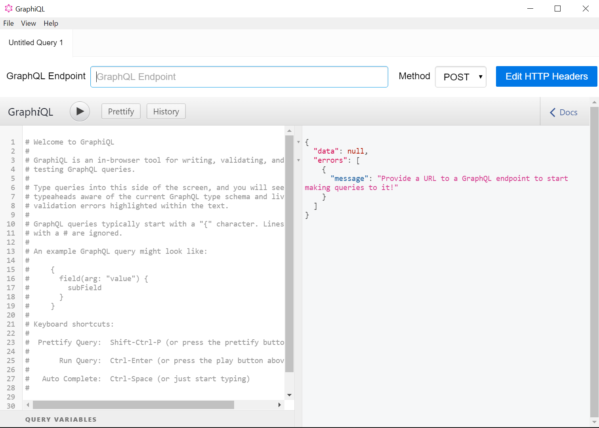
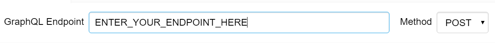
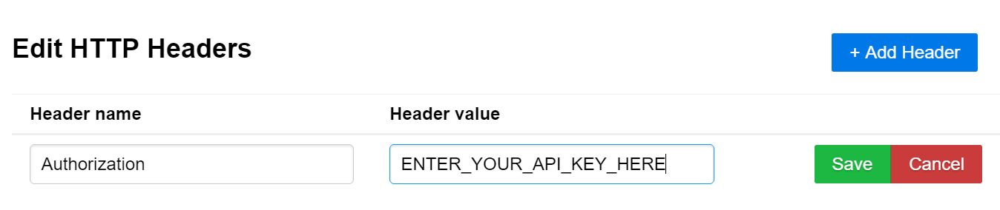
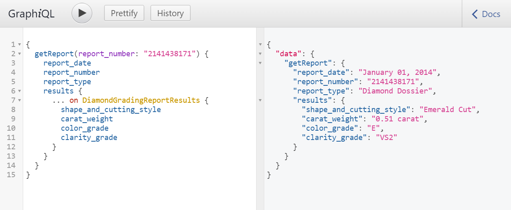

# GIA Report Results API Quickstart Guide

Use this guide to get started with the GIA Report Results API. You will use the open-source GraphiQL software to query the API and examine the responses.

## Before you begin

You must obtain a sandbox or production API key by following the onboarding process described in [GIA Report Results API](https://gia.edu/report-results-api).

You will also receive the API endpoint URL, which will be required in step 2.

## Step 1: Download and install GraphiQL

GraphiQL is an application that will allow you to explore and query the fields available in the API.

Download the latest version for your OS from the [GitHub Releases](https://github.com/skevy/graphiql-app/releases) page.



## Step 2: Enter your API endpoint

Enter the endpoint given to you when you obtained your API key and set the method to __POST__.



## Step 3: Enter your API key

You will need to add an HTTP Header `Authorization` with your key as the value.

1. Click __Edit HTTP Headers__
2. Click __+ Add Header__
3. Enter `Authorization` under __Header Name__
4. Enter your API key under __Header Value__



## Step 4: Query the API

You are now ready to query the API. 

Enter this query into the left-hand side of the GraphiQL window and press the execute query icon.

```
{
  getReport(report_number: "2141438171") {
    report_date
    report_number
    report_type
    results {
      ... on DiamondGradingReportResults {
        shape_and_cutting_style
        carat_weight
        color_grade
        clarity_grade
        cut_grade
      }
    }
  }
}
```



__Congratulations!__ You are now able to query the GIA Report Results API.

## Step 5: Check your quota

GIA Report Results API usage is controlled by quotas. When your quota reaches zero, you will no longer be able to query for reports.

You may check your quota limit at any time by querying `getQuota`. Checking your quota does not affect your remaining quota.

```
{
  getQuota{
    remaining
  }
}
```

_Pro Tip:_ You can also obtain your remaining quota with each `getReport` request.

## Step 6: Explore the API

One of the great benefits of GraphQL is that the API has a well-defined schema. This means that you can learn about the API from the API itself and most tools will help you with features like auto-complete and documentation navigators.

In GraphiQL, click the __Docs__ icon to expand the documentation pane and begin exploring.


