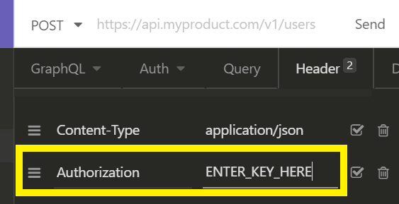
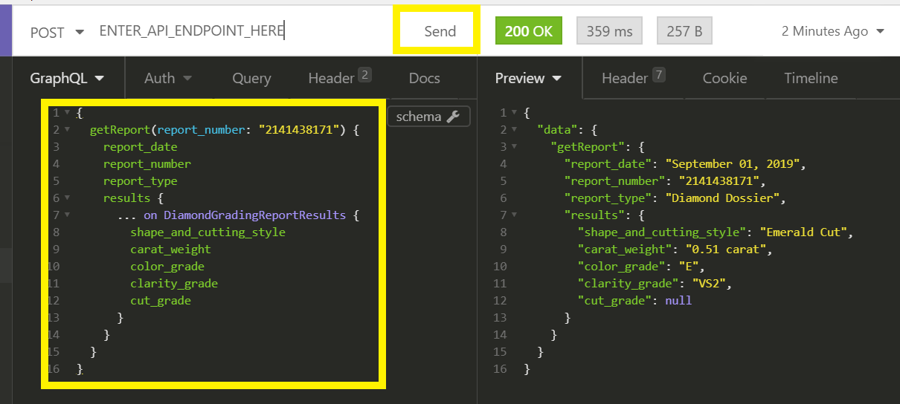

# GIA Report Results API Quickstart Guide

Use this guide to get started with the GIA Report Results API. 

You will use the free and open-source Insomnia application to explore and query the API.

## Before you begin

You will need:

- Your production or sandbox API key
- The API endpoint URL

Obtain your API key and URL by following the onboarding process described in [GIA Report Results API](https://gia.edu/report-results-api).

## Step 1: Download and install Insomnia Core

Visit [https://insomnia.rest](https://insomnia.rest) and download __Insomnia Core__ for your operating system.


After downloading the installer, double click the file to install the Insomnia. Now, open the application and get ready to create your first HTTP request.

## Step 2: Create a GraphQL Request

To create your first request, click the plus icon at the top of the sidebar and select New Request. 


You will then be prompted to give the request a name and choose its HTTP method.

1. Enter __GIA Report Results__ into the __Name__ field
2. Choose __POST__ 
3. Choose __GraphQL__
4. Click __Create__


After the request is created, enter the URL you received from GIA following the signup process.


## Step 3: Enter your API key

You will need to add an HTTP Header `Authorization` with your key as the value.

1. Click __Header__
2. Enter `Authorization` as the __Header__
3. Enter your API key as the __Value__



Leave the `Content-Type` header with value `application/json`

## Step 4: Query the API

You are now ready to query the API. 

Enter this query into the left-hand side of the Insomnia window and press __Send__
```
{
  getReport(report_number: "2141438171") {
    report_date
    report_number
    report_type
    results {
      ... on DiamondGradingReportResults {
        shape_and_cutting_style
        carat_weight
        color_grade
        clarity_grade
        cut_grade
      }
    }
  }
}
```



__Congratulations!__ You are now able to query the GIA Report Results API.

## Step 5: Check your quota

GIA Report Results API usage is controlled by quotas. When your quota reaches zero, you will no longer be able to query for reports.

You may check your quota limit at any time by querying `getQuota`. Checking your quota does not affect your remaining quota.

```
{
  getQuota{
    remaining
  }
}
```

_Pro Tip:_ You can also obtain your remaining quota with each `getReport` request.

## Step 6: Explore the API (Bonus!)

One of the great benefits of GraphQL is that the API has a well-defined schema. This means that you can learn about the API from the API itself and most tools will help you with features like auto-complete and documentation navigators.

In Insomnia, click the __Schema__ icon and __Show Documentation__.


The documentation panel will open, allowing you to expore the API and its fields.
